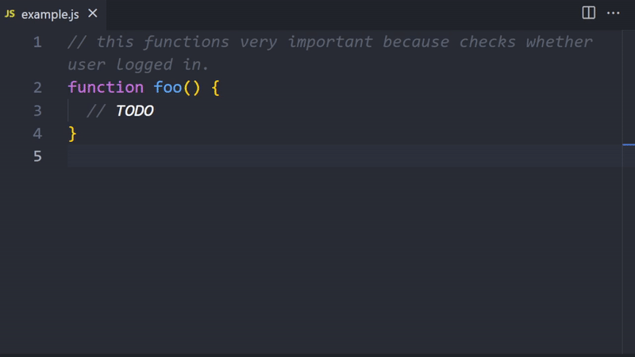
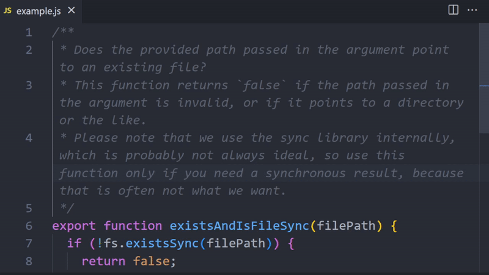
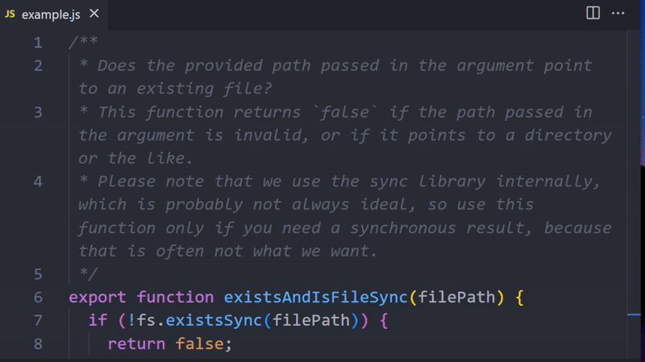

<div align="center">
  
</div>

# Text Companion

> Use AI to shorten comments, to fix grammar errors, and more

## Features

### Fixing grammar and spelling issues

Turn this:

```
// this functions very important because checks whether user logged in.
```

... into this:

```
// This function is very important because it checks whether the user logged in.
```



### Shortening text

Turn this:

```
Does the provided path passed in the argument point to an existing file?
This function returns `false` if the path passed in the argument is invalid,
or if it points to a directory or the like.
Please note that we use the sync library internally,
which is probably not always ideal,
so use this function only if you need a synchronous result,
because that is often not what we want.
```

... into this:

```
Does the provided path passed point to an existing file?
Returns `false` if invalid or points to a dir.
Note: Uses sync library internally, so use only if you need a synchronous result.
```



### Making text easier to understand

Turn this:

```
Does the provided path passed in the argument point to an existing file?
This function returns `false` if the path passed in the argument is invalid,
or if it points to a directory or the like.
Please note that we use the sync library internally,
which is probably not always ideal,
so use this function only if you need a synchronous result,
because that is often not what we want.
```

... into this:

```
Does the provided path passed in the argument point to an existing file?

This function returns `false` if:
- The path passed in the argument is invalid, or
- It points to a directory or the like.

Please note that we use the sync library internally,
which is probably not always ideal.
Therefore, use this function only if you need a synchronous result;
asynchronous operations are often preferred.
```



## Usage

### Create an API Key

Text Companion uses OpenAI. You need to provide an API Key to use the extension.

- Create a new API Key on [https://platform.openai.com/account/api-keys](https://platform.openai.com/account/api-keys)
- Open the command palette in VSCode and run the following command:  
  `Text Companion: Set OpenAI API Key`

### Run the text improvement commands

First, select the text you want to improve.
From the command palette, run one of the following commands:

- `Text Companion: Shorten the selected text`
- `Text Companion: Make the selected text easier to understand`
- `Text Companion: Fix grammar and spelling issues in the selected text`

The selected text will be replaced with the improved one. Not happy with your results? Simply use the undo command like you are used to from regular text editing.
